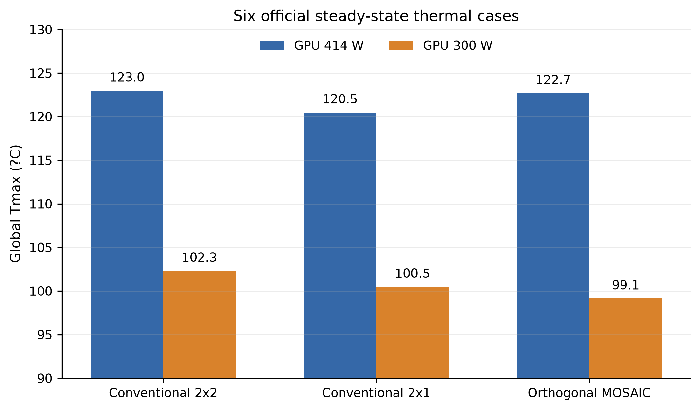
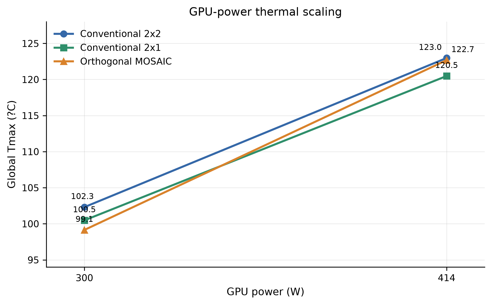
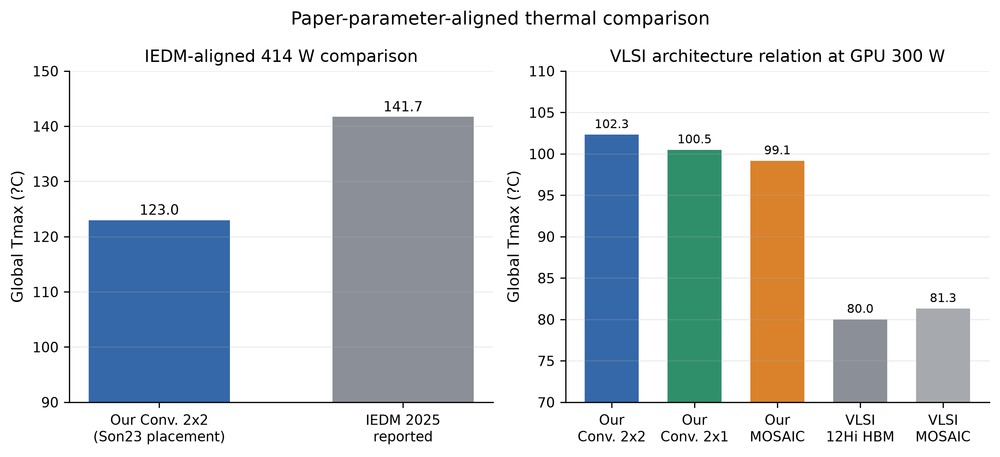

# Thermal results overview

## Official six-case results

| Architecture | GPU power | Memory power | Total power | Global Tmax | HBM/Memory Tmax | Hotspot component |
|---|---:|---:|---:|---:|---:|---|
| Conventional 2x2 | 414 W | 160 W | 574 W | 122.9715 degC | 122.4325 degC | GPU FEOL |
| Conventional 2x2 | 300 W | 160 W | 460 W | 102.3078 degC | 101.9196 degC | GPU FEOL |
| Conventional 2x1 | 414 W | 160 W | 574 W | 120.4741 degC | 119.8868 degC | GPU FEOL |
| Conventional 2x1 | 300 W | 160 W | 460 W | 100.4761 degC | 100.0521 degC | GPU FEOL |
| Orthogonal MOSAIC | 414 W | 156.8 W | 570.8 W | 122.6727 degC | 105.8671 degC | GPU FEOL |
| Orthogonal MOSAIC | 300 W | 156.8 W | 456.8 W | 99.1471 degC | 87.2945 degC | GPU FEOL |

Conventional HBM uses Son23 component-aware vertical placement. Orthogonal
MOSAIC retains uniform 1.6 W/die placement in each die BEOL.

## GPU-power scaling

| Architecture | Tmax at 300 W | Tmax at 414 W | Delta T over 114 W | Delta T / 114 W |
|---|---:|---:|---:|---:|
| Conventional 2x2 | 102.3078 degC | 122.9715 degC | 20.6637 K | 0.1813 K/W |
| Conventional 2x1 | 100.4761 degC | 120.4741 degC | 19.9980 K | 0.1754 K/W |
| Orthogonal MOSAIC | 99.1471 degC | 122.6727 degC | 23.5256 K | 0.2064 K/W |

## Base-die removal optimization

The no-base intervention removes the 5 um `HBM_Base_BEOL` and 50 um base
silicon from every physical stack while retaining the 40 um GPU-HBM uBump and
all 12 DRAM dies. Logic power is removed with the logic die, so HBM power is
128 W rather than 160 W. The 55 um released above each shortened HBM column is
filled with Mold under the existing package-cavity rule; the TIM and Lid
planes are unchanged.

| Layout / GPU power | Base-present Tmax | Base-removed Tmax | Delta T (removed - present) | Base-removed DRAM Tmax |
|---|---:|---:|---:|---:|
| Conventional 2x2 / 414 W | 122.9715 degC | 131.7286 degC | +8.7571 K | 125.9736 degC |
| Conventional 2x2 / 300 W | 102.3078 degC | 107.8653 degC | +5.5575 K | 103.7450 degC |
| Conventional 2x1 / 414 W | 120.4741 degC | 126.4554 degC | +5.9813 K | 124.5038 degC |
| Conventional 2x1 / 300 W | 100.4761 degC | 104.1459 degC | +3.6698 K | 102.7367 degC |

The GPU 414-to-300 W Tmax reduction is 23.8633 K for no-base 2x2 and
22.3095 K for no-base 2x1. The hotspot component remains GPU FEOL in all four
cases. IEDM reports approximately -3.7 K for base-die removal; the current
technology-level intervention instead gives positive deltas, so its trend is
opposite. This comparison includes both removal of the base-die thermal layers
and removal of the corresponding 8 W per physical stack logic power.

## Paper-parameter-aligned comparison

### IEDM 2025

| Comparison | Our result | IEDM reported | Difference |
|---|---:|---:|---:|
| Conventional 2x2, GPU about 414 W | 122.9715 degC | about 141.7 degC | -18.7285 K; absolute difference 18.7285 K |
| GPU 414 to 300 W sensitivity, Conventional 2x2 | 20.6637 K | about 20.8 K | -0.1363 K |
| GPU 414 to 300 W sensitivity, Conventional 2x1 | 19.9980 K | about 20.8 K | -0.8020 K |

The IEDM baseline uses commercial non-uniform 0.5 mm power maps. The current
comparison is paper-parameter-aligned and is used for trend consistency and
thermal-sensitivity comparison. Both conventional layouts show GPU-power
sensitivity close to the reported approximately 20.8 K change.

### VLSI 2026

| GPU 300 W comparison | Conventional reference | MOSAIC | MOSAIC minus conventional |
|---|---:|---:|---:|
| Our Conventional 2x2 vs Orthogonal | 102.3078 degC | 99.1471 degC | -3.1607 K |
| Our Conventional 2x1 vs Orthogonal | 100.4761 degC | 99.1471 degC | -1.3289 K |
| VLSI reported 12Hi HBM vs MOSAIC | about 80.0 degC | about 81.3 degC | +1.3 K |

The sign of the architecture delta differs, but all three current 300 W cases
remain within 3.2 K of one another. This supports the same architecture-level
observation that Orthogonal MOSAIC and conventional HBM occupy a close system
Tmax range while MOSAIC provides different capacity scaling.

## Key observations

1. Removing the internal y-direction Mold seam lowers Conventional 2x1 Tmax
   relative to 2x2 by 2.4974 K at GPU 414 W and 1.8317 K at GPU 300 W.
2. Reducing GPU power from 414 W to 300 W lowers Tmax by 20.6637 K for
   Conventional 2x2, 19.9980 K for Conventional 2x1, and 23.5256 K for
   Orthogonal MOSAIC.
3. IEDM absolute Tmax differs by 18.7285 K, while the 2x2 GPU-power sensitivity
   differs from the reported trend by only 0.1363 K.
4. At GPU 300 W, Orthogonal MOSAIC is 3.1607 K below Conventional 2x2 and
   1.3289 K below Conventional 2x1, keeping the three architectures at a close
   system Tmax level for capacity-versus-thermal scaling discussion.

Legacy conventional uniform-power results are intentionally excluded from all
tables and figures on this page.
